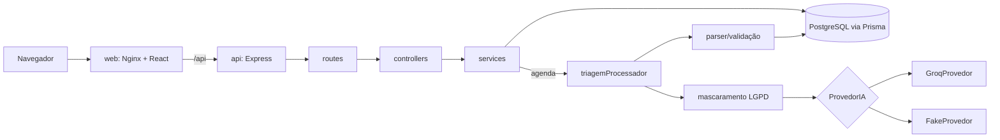

# HelpDesk Inteligente

Aplicação de abertura e acompanhamento de chamados de suporte com triagem assistida por IA. Ao criar um chamado, um LLM sugere categoria, prioridade, resumo e uma resposta inicial; um atendente decide se aceita ou rejeita a sugestão.

**Stack:** Node.js 20 + TypeScript + Express 5 + Prisma (backend), React 18 + Vite + TypeScript + TanStack Query (frontend), PostgreSQL 16, Groq como provedor de LLM, Docker Compose.

## Como rodar

Pré-requisito: Docker com Docker Compose.

```bash
docker compose up --build
```

Esse comando sobe o banco, aplica as migrations (estrutura e dados iniciais), inicia a API e o frontend, usando a IA fake por padrão (não precisa de chave).

| Serviço | Endereço |
| --- | --- |
| Frontend | http://localhost:8080 |
| API | http://localhost:3333 |
| Swagger | http://localhost:3333/docs |
| Health check | http://localhost:3333/health |
| PostgreSQL | localhost:5433 (usuário/senha `helpdesk`) |

Usuários criados pela migration de dados iniciais:

| Perfil | E-mail | Senha |
| --- | --- | --- |
| Atendente | admin@helpdesk.local | admin123 |
| Solicitante | solicitante@helpdesk.local | solicitante123 |

O atendente pode mudar status e aceitar, rejeitar ou refazer a triagem. O solicitante pode abrir chamados, consultar e comentar.

Para recomeçar do zero (apaga o volume do banco): `docker compose down -v`.

### Rodando sem Docker (desenvolvimento)

```bash
docker compose up -d db           # só o banco, na porta 5433
cd backend && cp .env.example .env # ajuste DATABASE_URL para a porta 5433
npm install && npx prisma migrate deploy && npm run dev
cd ../frontend && npm install && npm run dev   # http://localhost:5173 (proxy para a API)
```

## Como ativar a IA real (Groq)

1. Crie uma chave em https://console.groq.com/keys (o plano gratuito atende ao uso deste projeto).
2. Crie um `.env` na raiz a partir do `.env.example` e preencha:
   ```env
   AI_PROVIDER=groq
   GROQ_API_KEY=sua-chave
   GROQ_MODEL=llama3-8b-8192
   ```
3. `docker compose up --build`.

Timeout e número de novas tentativas são configuráveis por `AI_TIMEOUT_MS` e `AI_MAX_RETRIES`. Com o provedor fake, inclua `[simular-falha-ia]` na descrição de um chamado para ver o estado de falha no painel da IA.

## Como rodar os testes

```bash
# Backend: unitários (sem banco)
cd backend && npm install && npm run test:unit

# Backend: integração contra PostgreSQL real (Testcontainers, precisa do Docker rodando)
npm run test:integration

# Backend: tudo
npm test

# Frontend: testes de componente
cd frontend && npm install && npm test
```

Cobertura: `npm run test:coverage` em cada pasta (relatório em `coverage/`).

| Tipo | O que cobre |
| --- | --- |
| Unitários (backend) | Todas as transições permitidas e 6 proibidas, estados finais, regra de Crítica, `resolvidoEm`; mascaramento de e-mail, telefone e CPF; parser da resposta da IA (válida, JSON inválido, categoria inexistente, prioridade inválida, campos faltando, resumo longo); retry e timeout |
| Integração (backend) | Login, validação 400, criação com triagem assíncrona, IA fora do ar e resposta inválida (chamado é criado e triagem fica `FALHOU`), dados pessoais não enviados ao LLM, fluxo completo de status, 403/404/409/422, aceitar/rejeitar/refazer triagem, listagem com filtros e dashboard. IA sempre mockada |
| Componentes (frontend) | Validação do formulário de chamado, painel da IA nos estados concluída/falhou/pendente, botões de status exibindo só transições permitidas |

## Arquitetura



```
backend/src
├── routes/        rotas por recurso, com autenticação e checagem de perfil
├── controllers/   leitura e validação da requisição (zod) e resposta HTTP
├── services/      regras de negócio (transições, triagem, dashboard) e acesso a dados
├── ai/            interface ProvedorIA, Groq, fake, prompt versionado, mascaramento, parser, retry
├── validators/    schemas zod de entrada
├── middlewares/   auth JWT, logs com correlation id, erros em Problem Details
└── docs/          documento OpenAPI servido em /docs
prisma/            schema.prisma e migrations (estrutura + dados iniciais)

frontend/src
├── api/           cliente HTTP, tipos e endpoints (isolados dos componentes)
├── hooks/         hooks de requisição com TanStack Query e contexto de autenticação
├── pages/         login, painel, lista, novo chamado, detalhe
├── components/    layout (sidebar), ui (estados, badges, paginação), chamados, dashboard
└── utils/         rótulos e formatação
```

**Fluxo da triagem:** `POST /api/chamados` grava o chamado, o histórico e uma triagem `PENDENTE` na mesma transação e responde 201 imediatamente. Em seguida a triagem é processada em background: o título e a descrição são mascarados, enviados ao provedor com timeout e retry, e a resposta é validada antes de ser salva como `CONCLUIDA` ou `FALHOU`. O frontend consulta o detalhe a cada 2 s enquanto a triagem está pendente. Triagens que ficarem pendentes por reinício da API são retomadas na inicialização.

## Funcionalidade com IA

**Proteção de dados.** Nome e e-mail do solicitante nunca são enviados ao LLM. Antes do envio, e-mails, CPFs e telefones no título e na descrição são substituídos por `[EMAIL]`, `[CPF]` e `[TELEFONE]` (`backend/src/ai/mascaramento.ts`). Os logs da chamada à IA registram apenas ids, provedor, modelo, latência, tentativas, tokens e sucesso/falha, e o logger tem redação para campos de e-mail e nome.

**Validação da saída.** `backend/src/ai/parser.ts` extrai o JSON (tolera blocos markdown), valida tipos e faixas com zod, confere se a categoria existe no banco (comparação sem acento e sem diferenciar maiúsculas) e se a prioridade é uma das quatro válidas. Qualquer falha marca a triagem como `FALHOU` com o motivo, sem afetar o chamado.

**Prompt.** Versionado em `backend/src/ai/prompt.ts` (`PROMPT_VERSAO = triagem-v1`, gravado em cada triagem). Foi construído assim:
- papel e idioma definidos no início (analista de suporte, português do Brasil);
- formato de saída explícito com os nomes exatos dos campos, reforçado por `response_format: json_object` na chamada à Groq;
- lista fechada de categorias montada a partir do banco a cada chamada, para que novas categorias entrem sem mudar código;
- critério objetivo para cada prioridade, porque sem isso o modelo tende a classificar tudo como Alta;
- limites de tamanho para resumo e resposta, e instrução para não prometer prazos nem inventar fatos;
- aviso sobre os marcadores de dados mascarados, para o modelo não tentar reconstruí-los;
- o chamado vai delimitado em tags `<chamado>` e o sistema instrui a tratá-lo como dado, reduzindo o risco de prompt injection;
- `temperature: 0.2` para respostas mais estáveis.

**Custo e qualidade.** Tokens de entrada e saída são gravados por triagem e somados no dashboard, que também mostra a taxa de aceitação geral e por categoria sugerida.

## Banco de dados e índices

Migrations em `backend/prisma/migrations`:
- `20261001000000_init`: tabelas, enums, chaves estrangeiras, CHECKs e índices.
- `20261001000100_dados_iniciais`: 2 usuários (senha com hash bcrypt via `pgcrypto`), 5 categorias e 40 chamados fictícios em todos os status, com datas relativas ao momento da migration, histórico, comentários e triagens aceitas, rejeitadas, concluídas e com falha.

Constraints relevantes: enums para status, prioridade, perfil e status da triagem; `resolvido_em` preenchido se e somente se o status for Resolvido ou Fechado; `resolvido_em >= criado_em`; confiança entre 0 e 1; triagem concluída/aceita/rejeitada exige sugestão completa.

| Índice | Por quê |
| --- | --- |
| `chamados (status, criado_em DESC)` | Filtro mais comum da listagem (por status) já devolve na ordenação padrão (mais recentes), evitando sort |
| `chamados (prioridade, criado_em DESC)` | Filtro por prioridade e ordenação por prioridade com desempate por data |
| `chamados (categoria_id)` | Filtro por categoria e chave estrangeira (Postgres não indexa FK automaticamente); usado também no JOIN do tempo médio por categoria |
| `chamados (criado_em DESC)` | Listagem sem filtros (ordenação padrão) e filtro por período |
| `chamados USING GIN (titulo gin_trgm_ops)` e `(descricao gin_trgm_ops)` | A busca usa `ILIKE '%texto%'`, que não aproveita B-tree; o índice trigram (`pg_trgm`) atende essa consulta |
| `comentarios (chamado_id, criado_em)` | Carregar os comentários do detalhe já ordenados |
| `historico_status (chamado_id, alterado_em)` | Carregar o histórico do detalhe já ordenado |
| `triagens_ia (chamado_id, criado_em DESC)` | Buscar a triagem mais recente de cada chamado (detalhe e listagem) |
| `triagens_ia (status)` | Retomar triagens pendentes na inicialização e agregações do dashboard |

O dashboard é resolvido no banco: `groupBy` do Prisma para totais por status e prioridade, e SQL com `AVG(EXTRACT(EPOCH ...))`, `COUNT(*) FILTER` e `GROUP BY` para tempo médio por categoria e métricas da IA (`backend/src/services/dashboardService.ts`).

## API

| Método e rota | Descrição |
| --- | --- |
| POST /api/auth/login | Login, devolve JWT |
| GET /api/categorias | Categorias |
| POST /api/chamados | Cria chamado e agenda a triagem |
| GET /api/chamados | Filtros `status`, `prioridade`, `categoriaId`, `busca`, `dataInicio`, `dataFim`; `pagina`, `tamanhoPagina`; `ordenarPor` (`criadoEm`/`prioridade`) e `direcao` |
| GET /api/chamados/{id} | Detalhe com comentários, histórico, triagem e transições permitidas |
| PATCH /api/chamados/{id}/status | Muda status (atendente) |
| POST /api/chamados/{id}/comentarios | Adiciona comentário |
| POST /api/chamados/{id}/triagem | Refaz a triagem (atendente) |
| POST /api/chamados/{id}/triagem/aceitar | Aplica categoria e prioridade sugeridas (atendente) |
| POST /api/chamados/{id}/triagem/rejeitar | Rejeita sem alterar o chamado (atendente) |
| GET /api/dashboard/resumo | Totais, tempo médio por categoria e métricas da IA |
| GET /health | API e banco |

## Bibliotecas utilizadas

| Biblioteca | Motivo |
| --- | --- |
| Express 5 | HTTP simples e conhecido; a v5 trata erros de handlers assíncronos sem wrapper |
| Prisma | ORM tipado com migrations versionadas em SQL |
| jsonwebtoken / bcryptjs | Autenticação JWT e verificação de senha |
| swagger-ui-express | Documentação OpenAPI em /docs |
| Vitest, Supertest, Testcontainers | Testes unitários e de integração contra PostgreSQL real |
| React Router | Rotas e filtros na URL |
| Recharts | Gráficos do dashboard |
| Testing Library | Testes de componente |